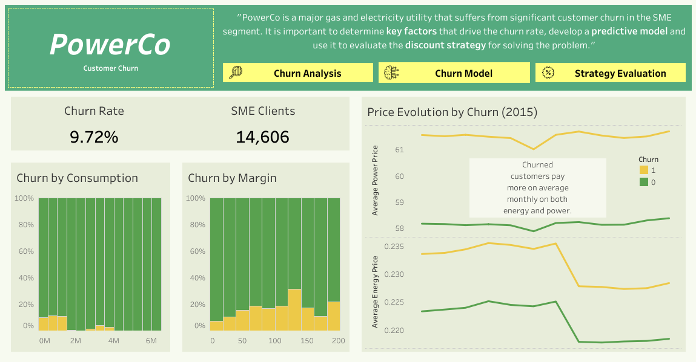

# Data Science Virtual Internship : Customer Churn Analysis & Modeling

## Introduction

This project is a part of the [BCG's Data Science virtual internship](https://www.theforage.com/virtual-internships/prototype/Tcz8gTtprzAS4xSoK/Data-Science-Virtual-Experience-Program).  
The project is about analyzing and modeling customer churn data for an electricity and gas commpany.  
The project is divided into 3 parts:

- Hypothesis framing and in depth exploratory data analysis
- Feature engineering and modeling with machine learning
- Business insights and recommendations using a dashboard

## Data

The data our client provided us with contains 2 datasets:

- `client_data.csv`: contains information about the clients
- `price_data.csv`: contains information about historical prices

## Tools

The project was done using Python 3 and the following libraries:

- `pandas`
- `numpy`
- `matplotlib`
- `seaborn`
- `scikit-learn`

Dashboards were created using Tableau Public, you can find them [here](https://public.tableau.com/app/profile/mohamed.nijadi/viz/energy-company-customer-churn/ChurnAnalysis).

Docker should be installed in order to use the provided Docker setup, even though using a Python virtual environment does the job.

## Analysis

The `docs` folder contains markdown files describing each step we took while performing the analysis and modeling.

## Setup

### Docker

If you want to use Docker (first time dockerizing a project) for running the notebooks in an isolated environment, you can use the provided Docker setup:

```bash
docker compose up --build
```

Then, using your favorite browser, go to `localhost:8888`, browse to the `notebooks` directory and open the notebooks in the given order (1 -> 2 ...), because each notebook gets the output of the previous one.

### Virtual environment

If you want to use a virtual environment, you can use the provided `virtualenv_requirements.txt` file by doing the following:

1. In the project directory, create a new virtual environment `customer-churn-venv`
2. Activate the virtual environment
3. Install the requirements

```bash
python -m venv customer-churn-venv
# Linux
source customer-churn-venv/bin/activate
# Windows
# customer-churn-venv\Scripts\activate.bar
pip install -r virtualenv_requirements.txt
```

Then, go to the `notebooks` directory and open the notebooks with Jupyter Notebook:

```bash
cd notebooks
jupyter notebook
```

Now again, use your favorite browser and go to `localhost:8888`, and open notebooks in the given order.

## Dashboard

Our dashboard contains three views (pages):

- **Churn Analysis**: contains a summary of the analysis



- **Churn Model**: holds our model's metrics and attributes importance


- **Strategy Evaluation**: Shows how the model positively impacts the business


## Acknowledgements

Huge thanks <3 to [Forage](https://www.theforage.com/) and [BCG](https://www.bcg.com/) for providing practitioners with real-world data science problems.
